# 自定义shader

*Author：大掌教* `用心做游戏`

### github项目地址 [传送门](https://github.com/fylz1125/ShaderDemos)

### 不方便上github可以去码云 [去码云](https://gitee.com/darkmoon/ShaderDemos)

> Q群：704391772  

### 开发工具

- cocos creator v1.8.2

- vscode v1.22.2

- 脚本：Typescript

### 使用说明

    效果器shader包含两个文件，例如高斯模糊效果包含GaussBlurEffect.ts和GaussBlursFrag.ts

    将对应的TS脚本拖到要施加效果的节点上即可以，方便快捷，自动施法，开箱即用 

    Scene/AmazingEffects/目录下能看到十几个酷炫的shader场景，用于参考学习

更多介绍见另一篇文档[说明文档](assets/resources/readme/StartScene.md)

---

### shader效果器 包含使用说明文档

1. [流动闪光特效](assets/resources/readme/FluxayEffect.md)：使图片产生流光效果和闪光特效，两种模式

2. [高斯模糊](assets/resources/readme/GaussBlurs.md)：用高斯模糊算法使图片产生模糊效果

3. [灰度图](assets/resources/readme/GrayEffect.md)：处理一个图片，使其变为灰色

4. [图片透明渐变](assets/resources/readme/TransferEffect.md)：透明图片渐变切换

5. [动态水波](assets/resources/readme/WaterWave.md)：使一张图片产生动态水波效果

6. [战争迷雾探照灯](assets/resources/readme/SearchLight.md)： 使一张图片产生战争迷雾效果，跟随触摸点照亮圆形区域

7. [溶解特效](assets/resources/readme/DissolveEffect.md)：使一张图片产生溶解消失的效果

---
### 酷炫shader实例

- amazingcolors 
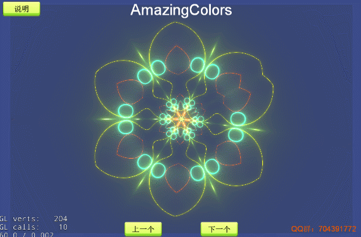

- clouds 
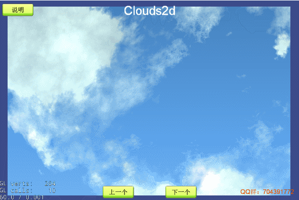

- clover 
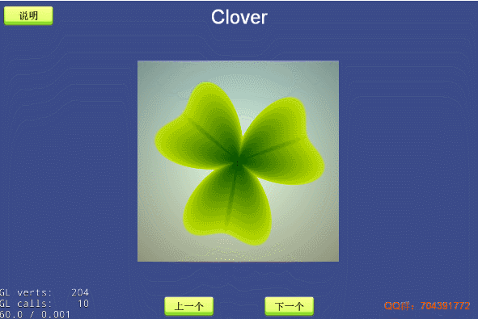

- color circle 

- color lights 
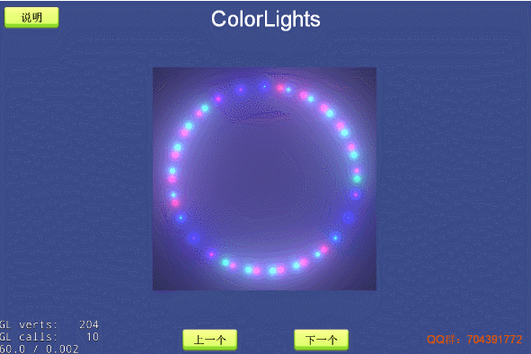

- deform flower 
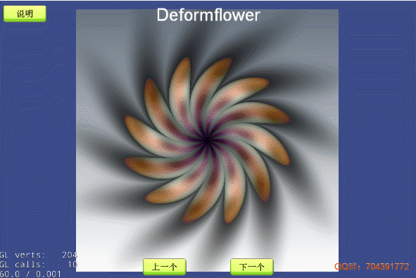

- flame fire 
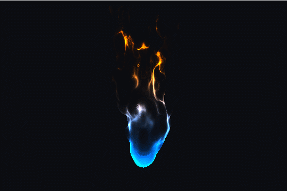

- glow circle 
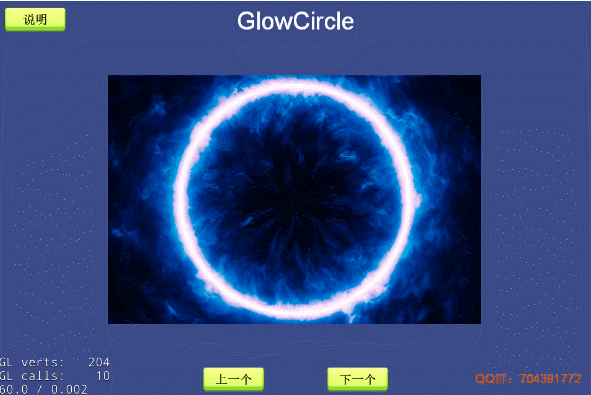

- grassy 
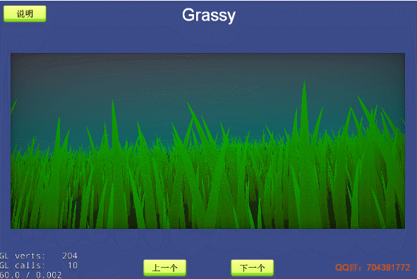

- beat heart 
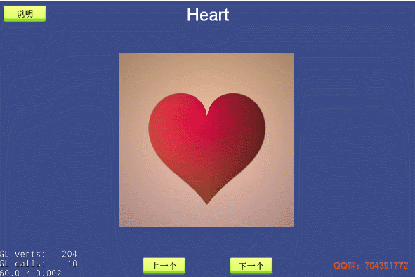

- light circle 
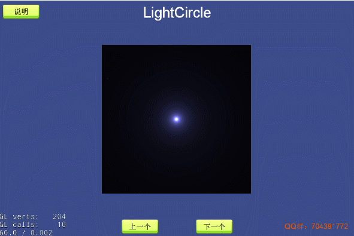

- light nets 
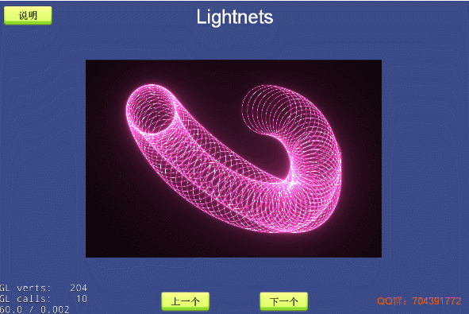

- light run 
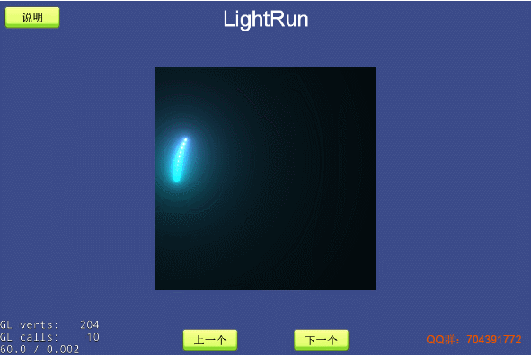

- obsession 
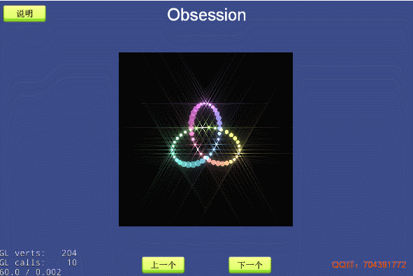

- swirling dots 

- tweaked 
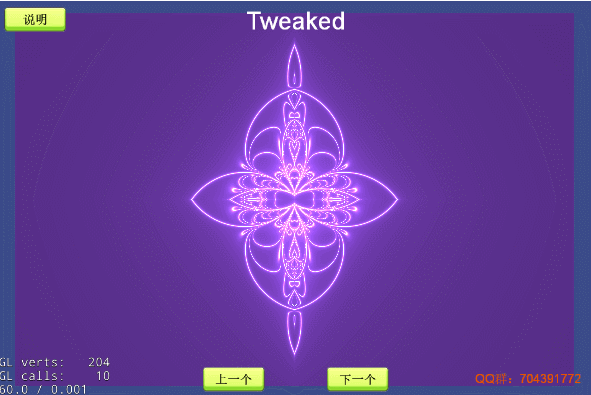

- Valentine Day 
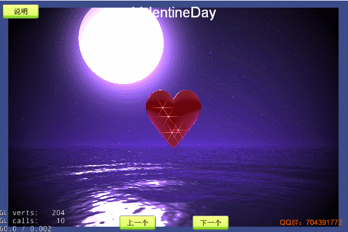

- Redcircle  
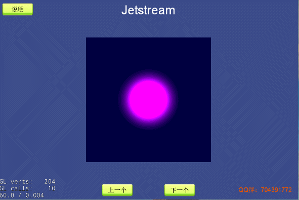

- Supermario  
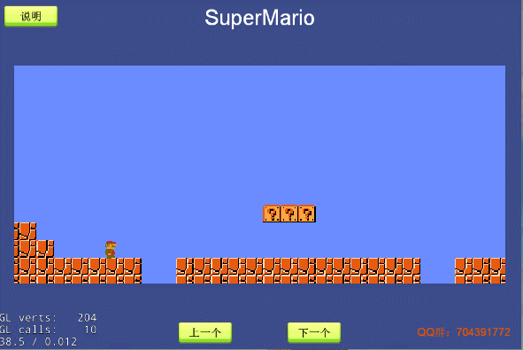

- StarBackground  
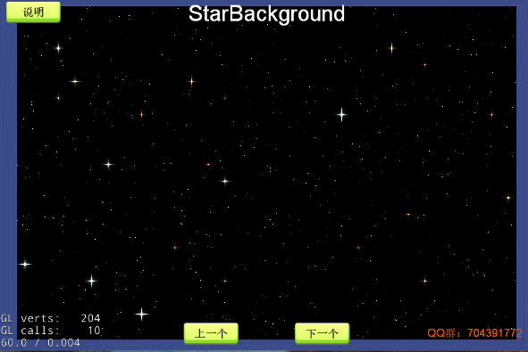
---

### 陆续更新，敬请关注，欢迎star