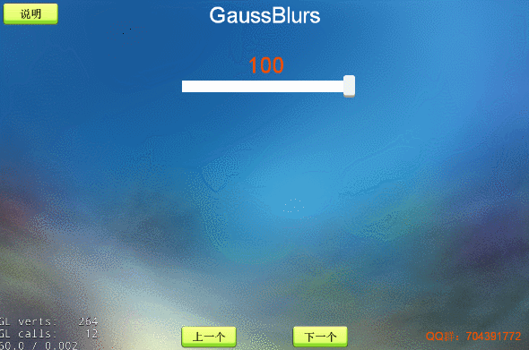

# 高斯模糊

### 效果
`用高斯模糊算法使图片产生模糊效果` 
`新增透明通道支持`

---

---

### 使用说明：

- 将`GaussBlurEffect.ts`和`GaussBlursFrag.ts`放到自己的项目   将`GaussBlurEffect.ts`拖到想要施加效果的节点上 

- 拖到想要施加效果的节点上，去掉slider控件和相关代码

- 高斯模糊特效可以控制模糊程度

- 模糊系数`bluramount`取值为`[0, 0.1]`

- 如果想要对节点及其子节点施加效果，勾选 `isAllChildrenUse` 即可