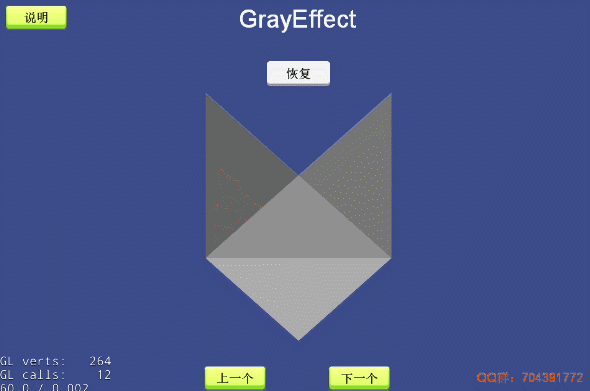

# 灰度图

### 效果
`将图片变成灰色`

---

---

### 使用说明
- 将`GrayEffect.ts`和`GrayFrag.ts`放到自己的项目   将`GrayEffect.ts`拖到想要施加效果的节点上 

- 默认对当前节点施加效果，如果想要节点及其子节点都施加效果，请勾选 `isAllChildrenUse`

- 采用这个shader变灰的图可以恢复原样，调用回调函数 `resetShader()`