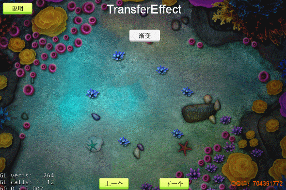

# 图片透明渐变

### 效果
`图片透明渐变切换过渡效果`

---

---

### 使用说明
- 将 `TransferEffect.ts` 和 `TransferFrag.ts`放到自己的项目 将`TransferEffect.ts`直接拖到一张精灵上，不需要加任何代码

- 如果一个节点包含子节点，也可以全部施加效果，勾选`isAllChildrenUse`即可
 但是效果不是很理想，会出现所有图片同时开始过渡

- 感谢cocos论坛的shader原作者 `yue19870813`提供的shader源码